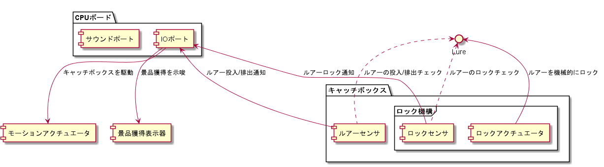

# システム構成について

 

構造ブロックは以下3つの機構に分割される

* CPUボード  
* キャッチボックス
* 景品獲得表示器
* モーションアクチュエーター

それぞれの機構の役割を以下表に示す。

| 機構名　　　　　　　　　　 | 機構の役割 |
| --------- | ---- |
| CPUボード | センサからの情報を取得して、内部状態を変更し、アクチュエーターに指示を出す機構 |
| キャッチボックス | 投入されたルアーをロックする機構と、ロックしたルアーが排出されるタイミングで景品獲得を判定する機構 |
| 景品獲得表示器 | CPUからの信号通知で景品獲得状態であることを外部に通知する機構 |
| モーションアクチュエーター | キャッチボックスあるいはロック機構を振動させ、遊技機を演出する機構 |
