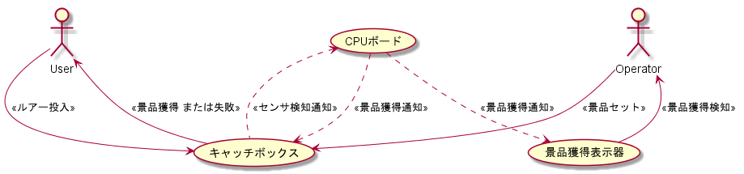
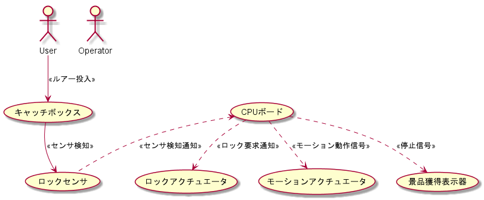
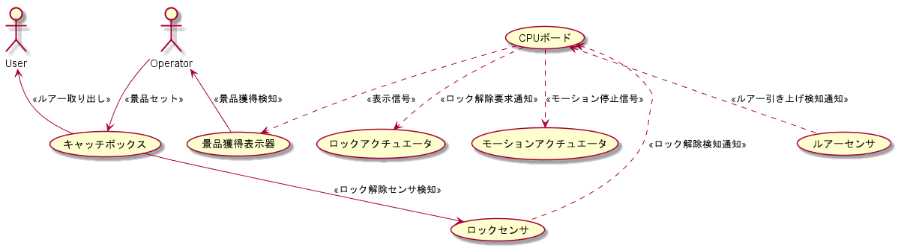

# ユースケース
システムは待機中とアクティブ中に別れ、ルアーの投入で待機中からアクティブ中状態に変化し、ルアーの引き上げによりアクティブ中から待機中に変化する。  
CPUボードの当たり判定がTrueの場合、ルアーはロックされOperatorによってルアーに景品が装着される。  
その後、Operatorが手動によりロックを解除し、ユーザーは景品を受け取る。  
当たり判定がFalseの場合はルアーはロックされない。  
  
  
!!! Note
    音源、画像、景品は非機能要件のため、ユースケースには含めない。  
  
## 待機中からのユースケース
待機中は投入されたルアーがロックアクチュエーターに固定されることをセンサで感知する。  
アクチュエータ固定を検知すると内部状態をアクティブ中に変更し、関連するソフトウェアの初期化処理を実施する。  
  

## アクティブ中からのユースケース
ロックアクチュエータに固定されたルアーは、モーションアクチュエーターによって、ロックアクチュエーターを含めて振動する。
ロックアクチュエーター全体を引き上げる負荷がかかると、ロックセンサが反応し、CPUボードにロック解除検知を通知する。  
  
ロック解除通知時にCPUボードが判定処理を行い、False判定されるとロックアクチュエーターが解除される。  
判定処理がTrueの場合は、オペレーターがルアーに景品をセットし、ロックアクチュエーターを手動で解除する。  
  
